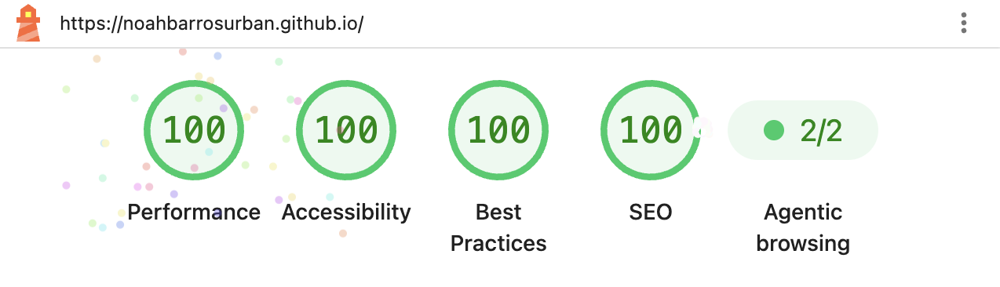

# Noah Barros Urban - Landing Page

> "Creativity is intelligence having fun." — Albert Einstein

  

**Hello, Dev!**

This repository holds the project for my landing page. The application was built with HTML, CSS and JavaScript, and was developed to serve as an online portfolio.

## Quick Access

> 🌐 The application is hosted on GitHub Pages: [https://noahbarrosurban.github.io/](https://noahbarrosurban.github.io/)

## Performance & Accessibility

The page is a static build with no framework and no build step, tuned against a Lighthouse audit (mobile profile, simulated throttling):

## Contact

Questions or feedback are welcome:

- [LinkedIn](https://www.linkedin.com/in/noahbarrosurban/)
- [GitHub](https://github.com/noahbarrosurban)
- [noahbarrosurban@gmail.com](mailto:noahbarrosurban@gmail.com)

## Credits

This project was inspired by an [open source web application](https://github.com/bedimcode/responsive-portfolio-website-JhonDoe), which served as the basis for part of the implementation.
